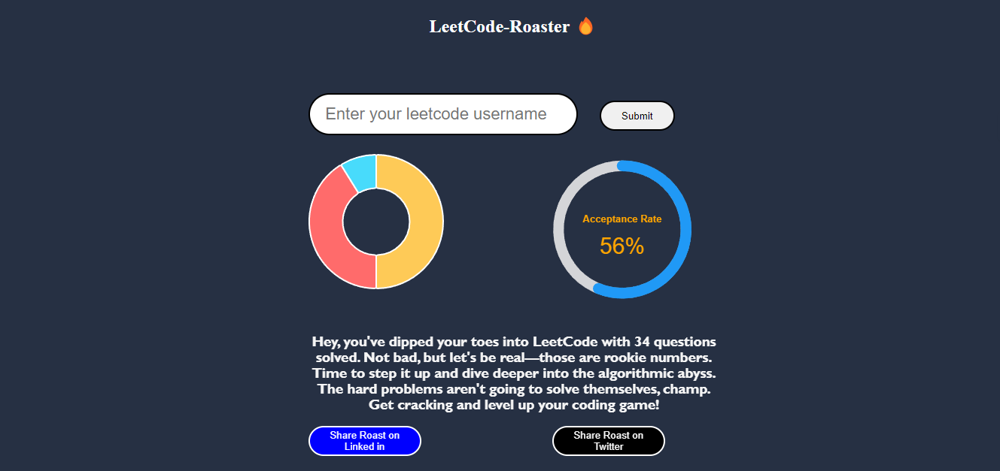
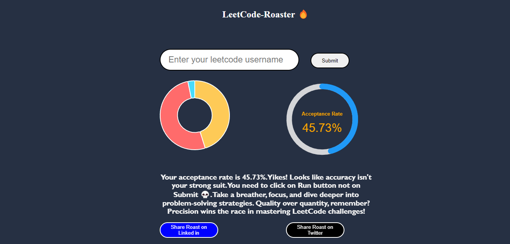

# LeetCode Roaster
Try it out: https://vaibhavkothari33.github.io/LeetCode-Roster/

## Overview
The LeetCode Roaster is a web application that fetches user statistics from the LeetCode API and generates humorous and motivational messages ("roasts") based on their performance. It also visualizes their acceptance rate and question-solving distribution using charts.

## Features
- Fetches user data from the LeetCode API.
- Generates roasts based on user performance metrics.
- Displays a radial chart for acceptance rate.
- Shows a doughnut chart for question-solving distribution.
- Provides feedback messages tailored to different levels of performance.

## Technologies Used
- HTML
- CSS
- JavaScript (Async/Await, Fetch API)
- Chart.js (for doughnut chart)
- ApexCharts (for radial chart)

## How to Use
1. Enter a valid LeetCode username.
2. Click on the "Submit" button.
3. View the generated roast and charts based on the user's LeetCode performance.

## Installation
No installation required. Simply open the `index.html` file in a web browser.

## Screenshots
Roasts generated for different users.

## Credits
- **Developed by:** Vaibhav Kothari
- **API Used:** LeetCode Stats API (https://leetcode-stats-api.herokuapp.com)

